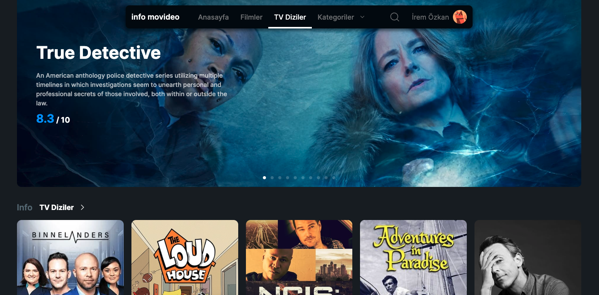
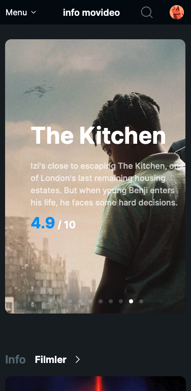

###  "info movideo" Prime Video-like project where detailed movie and TV series information is displayed using public API

# Info Movideo, Movie App

1- Home Page 

- Homepage 
- Movies
- Tv Shows 
- Categories
- Search Bar
- Profile

2- Home Page 

- Sticky Nav Bar
- Swiper 

3- Movie Page

- Movie Cards
- Swiper 

4- Show Page

- Show Cards
- Swiper 

5- Categories Page

- Categorie Cards
- Categori results 

6- Show Detail Page

- Show Info
- Simular Page Swiper 

7- Search Bar 

- Search Bar Overview

8- Results Page

- Search Results Page 
- Result Cards

9- Tablet Screen Overview

- Tablet Navbar overview
- Tablet Show Card 

10- Phone Screen Overview

- Phone Navbar overview
- Tablet Swiper 

11- Phone Screen Overview

- Phone Navbar Menu overview
- Nav Categories overview

